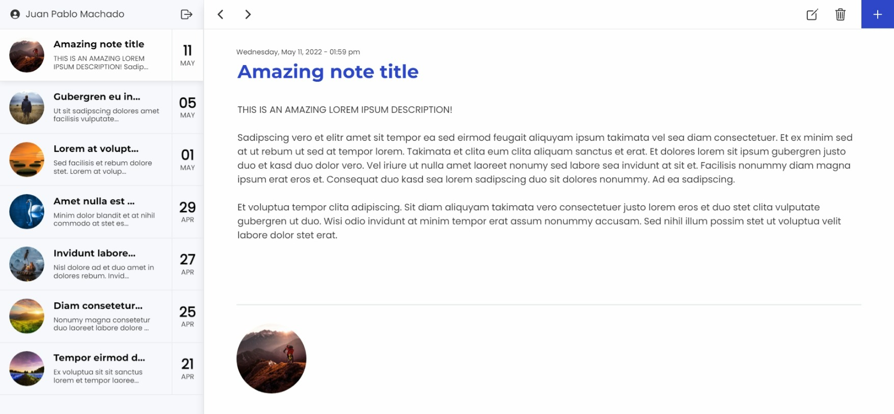

# Journal App

Journal App web application to list, add, edit, remove and upload images of your important notes. Developed in React using Hooks and Redux, Firebase and SASS. [Built with 🛠️](#built-with-️)

*CRUD, image upload, auth system with google and facebook authentication*

## [Try demo](https://ju4npx.github.io/journal-app/)



### Table of contents 📃

- [Journal App](#journal-app)
  - [Try demo](#try-demo)
    - [Table of contents 📃](#table-of-contents-)
  - [Starting 🚀](#starting-)
    - [Pre-requirements 📋](#pre-requirements-)
    - [Installation 🔧](#installation-)
  - [Deployment 📦](#deployment-)
  - [Built with 🛠️](#built-with-️)


## Starting 🚀
  
### Pre-requirements 📋

* [Git](https://git-scm.com/)
* [npm](https://www.npmjs.com/)
* [React](https://es.reactjs.org/docs/getting-started.html)

### Installation 🔧

Local installation:

```bash
# Clone this repository
$ git clone https://github.com/Ju4npx/Journal-App.git

# Change directory to the project path
$ cd Journal-App
```

Setup:
```bash
# Install dependencies
$ npm install

# Copy .env file
$ cp .env.example .env
```
server **.env** file setup:

```shell
REACT_APP_FIREBASE_API_KEY=
REACT_APP_FIREBASE_AUTH_DOMAIN=
REACT_APP_FIREBASE_PROJECT_ID=
REACT_APP_FIREBASE_STORAGE_BUCKET=
REACT_APP_FIREBASE_MESSAGING_SENDER_ID=
REACT_APP_FIREBASE_APP_ID=
```

## Deployment 📦

```bash
# Run application
$ npm run start
```

Open [http://localhost:3000](http://localhost:3000) to view it in your browser.

## Built with 🛠️

* [React](https://es.reactjs.org/) - Frontend framework
* [React Redux](https://react-redux.js.org/) - State management
* [Firebase](https://firebase.google.com/) - Backend platform
* [SASS](https://sass-lang.com/) - CSS extension

---
⌨️ with ❤️ by [Juan Pablo Machado](https://github.com/Ju4npx ) 😊 